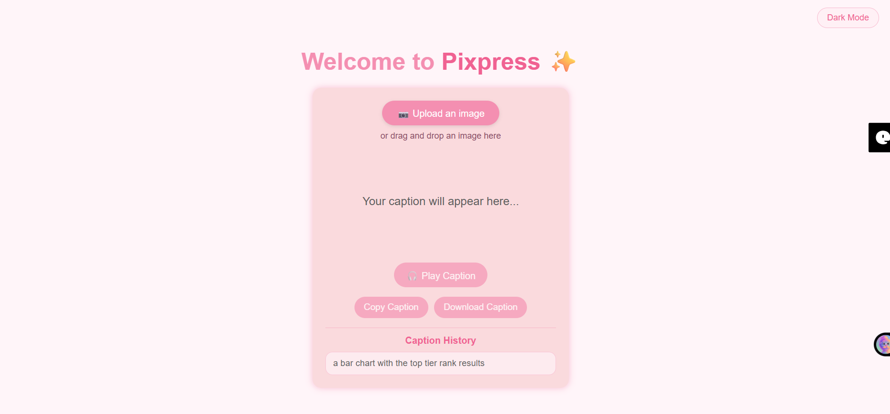
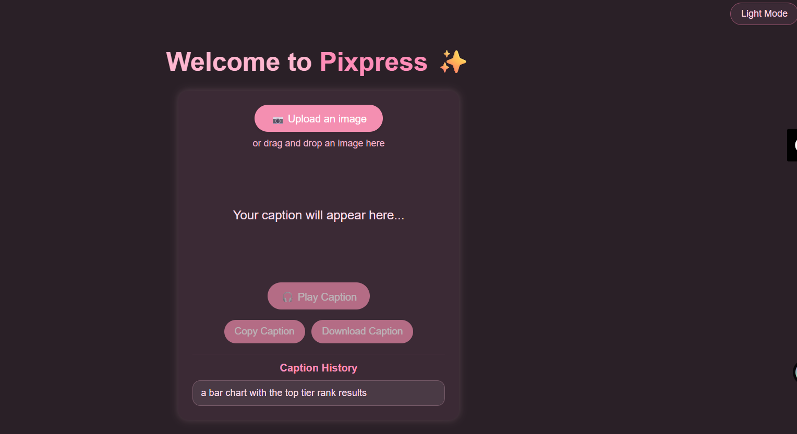
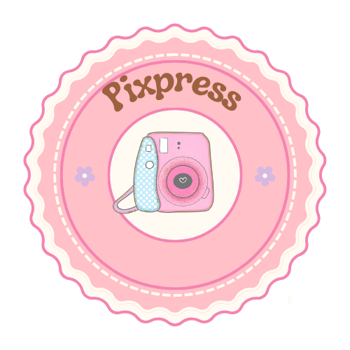

Pixpress
Pixpress is an AI-powered image caption generator built using Flask and the BLIP image captioning model. Users can upload an image and receive an automatically generated caption with additional features such as speech playback, caption history, dark mode, and drag-and-drop uploads.

Features
🖼 Upload images
🤖 AI-powered image caption generation
🔊 Text-to-speech playback
📋 Copy caption to clipboard
📥 Download caption as a text file
🌓 Dark and light theme support
📜 Caption history
📂 Drag-and-drop image upload
⚡ Loading spinner and status messages
✅ Input validation and error handling
📱 Responsive UI
Tech Stack
Frontend
HTML
CSS
JavaScript
Backend
Python
Flask
AI Model
Salesforce BLIP Image Captioning Model
Project Structure
pixpress/
│
├── assets/
├── uploads/
├── app.py
├── index.html
├── script.js
├── style.css
├── requirements.txt
├── README.md
└── .gitignore
How It Works
User uploads an image.
The image is sent to the Flask backend.
The BLIP model generates a caption.
The caption is displayed on the webpage.
Users can listen to the caption, copy it, download it, or access previous captions.
Installation
Clone the repository
git clone https://github.com/Hrishithag/pixpress.git
cd pixpress
Install dependencies
pip install -r requirements.txt
Run the application
python app.py
Open:

http://127.0.0.1:5000
Screenshots
## Screenshots

### Light Mode

### Dark Mode

## Logo

License
This project is open source and available under the MIT License.
